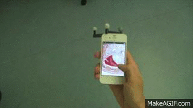
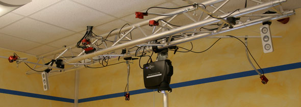

<section id="table-of-contents" class="toc">
  <header>
    <h3>Overview</h3>
  </header>

*  Auto generated table of contents
{:toc}

</section><!-- /#table-of-contents -->

# Why Spatial Displays? The Superiority of Dynamic Peepholes
<!---

-->
In our [CHI 14 paper](../pub) we described a user study comparing spatial navigation using the peephole metaphor with multitouch:
_"The results surpassed our expectations in various ways. On average, participants were more than **35% faster** with the spatial approach, even though all of them were conversant with Pinch-Drag-Flick and used the spatial technique for the first time. This finding was further supported by the questionnaires, where participants rated the spatial approach at least as good as or even better than the touch-based counterpart."_

# 

|   	| low dimensional (below 6DoF)|high dimensional (6DoF)  	|
|---	|---	|---	|
| internal non-visual| Tilt to zoom  	|   	|
| internal visual without IR  	|   	|   	|
| internal visual with IR  	|   	|   	|
| external visual with IR  	| TangibleDisplaysForTheMasses, HuddleLamp  	|   	|

# Overview of Low Cost Tracking Alternatives

Ever since we showed our interactivity at CHI´14 and at the [IML Dresden](http://mt.inf.tu-dresden.de/en) Open Lab Days after ITS2014, inquisitive natures of various kinds have been looking at our OptiTrack System (priced at more than €10.000) and wondered: __"Is that really necessary?"__
I have been pointed to various projects, that people believed could replace the OptitrackSystem. So I decided to write this article to provide an overview of the suggestions and my thoughts about them.

# INTERNAL NON-VISUAL SENSORY FUSION
<iframe width="560" height="315" src="//www.youtube.com/embed/Fb1JwWkk1hI?rel=0" frameborder="0" allowfullscreen></iframe>
One of our reviewers pointed out that the Samsung S3 had a tilt to zoom feature using the gyrosope - but if you think about it we need 6 DoF tracking and this is only 1 DoF. However if you have the acceleration and orientation of a device you can __theoretically__ determine its position over time.

<iframe width="420" height="315" src="//www.youtube.com/embed/C7JQ7Rpwn2k?rel=0&t=23m8s" frameborder="0" allowfullscreen></iframe>

This Google Tech Talk on fusing data of the intrinsic sensors and integrating accelerometer data will introduce you to the main problems you are facing when integrating over noisy data. I am not aware that anyone was able to solve this yet.

# INTERNAL VISUAL SENSORY FUSION: LookingAtYou
<video width="420" height="315" controls="controls">
<source src="http://research.microsoft.com/en-us/um/redmond/projects/lookingatyou/Video/LookingAtYou.mp4" type="video/mp4">
</video>
Microsoft research got very close to a solution. They built an image viewing application that adds face tracking to the input channel for sensory fusion.
Still looking at the video we can identify two main problems here: inaccuracy and latency. These two issues will influence the user experience tremendously. In other words: __you loose that 35% when you use any of the above solutions.__

# INTERNAL VISUAL LOCALIZATION AND MAPPING - SLAM and TANGO
I believe that mobile 6DoF tracking will originate from computer vision research, more precisely the kind CV research that is driven by the billon dollar research area of robotics. If you think about it Spatial Displays are by far not the only devices that need to be aware of their own location and rotation with in a reference frame. This is also a very fundamental question in robotics: robots constantly need to know what their environment looks like and where they are located within it.  This computational problem is called __SLAM__ _Simultaneous localization and mapping_. There have been amazing advances in that field, otherwise we would not have seen [self driving cars](http://en.wikipedia.org/wiki/Autonomous_car#2010s). 

If you want to build a spatial displays yourself, without using a depth camera, I suggest you take a look at [LSD-SLAM algorithm developed by Computer Vision Group at TUM](http://vision.in.tum.de/research/lsdslam?redirect=1) (thx [Robert](http://www.rwalter.de)). This algorithm solves the SLAM problem using a single camera, and runs on a smartphone. And yet again I wonder what the accuracy would be like, compared to an OptiTrackSystem

<iframe width="560" height="315" src="//www.youtube.com/embed/GnuQzP3gty4?rel=0" frameborder="0" allowfullscreen></iframe>

However of all projects mentioned the far most promising solution to our problem could be [Project Tango](https://www.google.com/atap/projecttango/#project) by ATAP (Google). As experts in Computer Vision and Robotics are working on it, I am really exited about this project. However, I wonder what the accuracy of the spatial localization will be like. I am convinced it takes quite a high accuracy to make the dynamic peephole metaphor work. It would be an interesting thing to find out how much exactly, wouldn't it?

<iframe width="560" height="315" src="//www.youtube.com/embed/44vppay5UDc?rel=0" frameborder="0" allowfullscreen></iframe>

__Update 5th December:__ I've been whitelisted for the Tango Dev kit! Hopefully i get to try it soon!

# EXTERNAL DEPTH IMAGE BASED TRACKING
For a long time we had to rely on external tracking systems for reliable spatial tracking. Now, with Tango, it seems we'll see spatially aware mobile devices which are available to the masses in the near future. Still, it will take some time until those device get a noticeable share of the market and it remains unclear how aware these devices will be of one another. This awareness of device of one another is an mandatory to map multiple Spatial Displays to the the same information space. So in the meantime if you need a less costly OptiTrack Alternative i suggest you look at stationary depth cameras for tracking. In my previous lab in Magdeburg Spindler et al. successfully used a Kinect to track the 3D location of a spatial display(see [Journal Article as pdf](http://imld.de/cnt/uploads/PuCTangibleDisplaysForTheMasses.pdf)). Another more openly available solution is HuddleLamp. 

<iframe width="560" height="315" src="//www.youtube.com/embed/XkmwG588zp0?rel=0" frameborder="0" allowfullscreen></iframe>

However HuddleLamp currently only provides 2D tracking. Maybe someone with a background in computer vision is  able to [fork HuddleLamp on Github](http://huddlelamp.org/#try-it) and extend it to 6DoF tracking. Since gyroscopes are available in most handheld devices, the only unknown dimension left is the height of the device above the ground plane. However if we remember the shape of the device on the ground plane we can calculate its hight by the changes in shape size when taking into account the already known rotation from the gyroscope.

# Some thoughts on what's next? Distributed User Interfaces with Spatial Displays
For a spatial aware display that ought to be used in a multimodal, mutlidisplay and multisuface environment two additional processes are required: Registration and Assignment.
In the registration process the device  notifies other proximate devices of its presence, capabilities and other properties relevant to the interaction scenario. After registration, the device is assigned to their role in the interaction with the user. These two processes should be automatic, and preferably decentral, so they do not create much overhead for the user. Here is an example of 

<iframe width="560" height="315" src="//www.youtube.com/embed/AyL_s6N6rNI?rel=0" frameborder="0" allowfullscreen></iframe>
