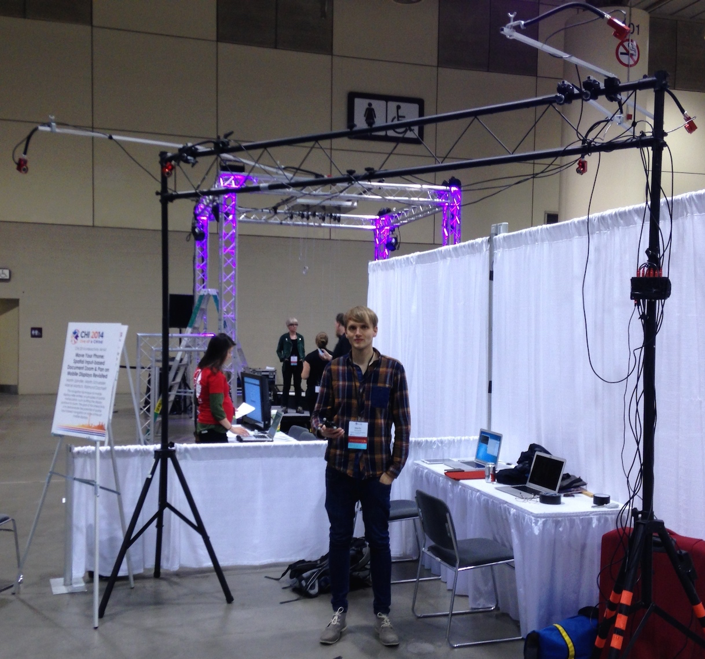

<section id="table-of-contents" class="toc">
  <header>
    <h3>Overview</h3>
  </header>

*  Auto generated table of contents
{:toc}

</section><!-- /#table-of-contents -->

# The Superiority of Dynamic Peepholes
<!---

-->
In our [CHI 14 paper](../pub) we described a user study comparing spatial navigation using the peephole metaphor with multitouch:
_"The results surpassed our expectations in various ways. On average, participants were more than **35% faster** with the spatial approach, even though all of them were conversant with Pinch-Drag-Flick and used the spatial technique for the first time. This finding was further supported by the questionnaires, where participants rated the spatial approach at least as good as or even better than the touch-based counterpart."_

# FAQ: _Why Didn't You Use the Built-in Gyro?_

Ever since we showed our interactivity at CHI´14 and at the [IML Dresden](http://mt.inf.tu-dresden.de/en) Open Lab Days after ITS2014, inquisitive natures of various kinds have been looking at our OptiTrack System (priced at more than €10.000) and wondered: __"Is that really necessary?"__
I have be pointed to various projects, that have used the gyro or the camera to track devices in space. Here are a couple of examples:

## Tilt to zoom
Apparently the Samsung S3 had a tilt to zoom feature - but if you think about it we need 6 DoF tracking and this is only 1 DoF.

<iframe width="560" height="315" src="//www.youtube.com/embed/Fb1JwWkk1hI?rel=0" frameborder="0" allowfullscreen></iframe>

### Sensor Fusion Approaches
<iframe width="420" height="315" src="//www.youtube.com/embed/C7JQ7Rpwn2k?rel=0&t=23m8s" frameborder="0" allowfullscreen></iframe>

This Google Tech Talk on fusing data of the intrinsic sensors and integrating accelerometer data will introduce you to the main problems you are facing when integrating over noisy data.

<video width="420" height="315" controls="controls">
<source src="http://research.microsoft.com/en-us/um/redmond/projects/lookingatyou/Video/LookingAtYou.mp4" type="video/mp4">
</video>

Microsoft research got very close to a solution. They built an image viewing application that adds face tracking to the input channel for sensory fusion.

So you see we have two main problems here:

- inaccuracy
- latency

These two issues will influence the user experience tremendously. In other words: you loose that 35% when you use one of the above solutions. So I am still waiting for someone to come up with a solution, so that we can get rid of the bulky OptiTrackSystem.

# How Long Until We Have Device Intrinsic Spatial Tracking?
I believe that mobile 6DoF tracking will originate from computer vision research, more precisely the kind CV research that is driven by the billon dollar research area of robotics. If you think about it Spatial Displays are by far not the only devices that need to be aware of their own location and rotation with in a reference frame. This is also a very fundamental question in robotics: robots constantly need to know what their environment looks like and where they are located within it.  This computational problem is called __SLAM__ _Simultaneous localization and mapping_. There have been amazing advances in that field, otherwise we would not have seen [self driving cars](http://en.wikipedia.org/wiki/Autonomous_car#2010s). So the far most promising solution to our problem could be [Project Tango](https://www.google.com/atap/projecttango/#project) by ATAP (Google). As experts in Computer Vision and Robotics are working on it, I am really exited about this project. However, I wonder what the accuracy of the spatial localization will be like. I am convinced it takes quite a high accuracy to make the dynamic peephole metaphor work. It would be an interesting thing to find out how much exactly, wouldn't it?

<iframe width="560" height="315" src="//www.youtube.com/embed/44vppay5UDc?rel=0" frameborder="0" allowfullscreen></iframe>

### Update 5th December: Tango Dev Kits
__I've been whitelisted for the Dev kit! Hopefully i get to try it soon!__

# Spatial Displays without depth cameras: LSD-SLAM
If you want to build a spatial displays yourself, without using a depth camera, i suggest you take a look at [LSD-SLAM algorithm developed by Computer Vision Group at TUM](http://vision.in.tum.de/research/lsdslam?redirect=1) (thx [Robert](http://www.rwalter.de)). This algorithm solves the SLAM problem using a single camera, and runs on a smartphone. And yet again I wonder what the accuracy would be like, compared to an OptiTrackSystem

<iframe width="560" height="315" src="//www.youtube.com/embed/GnuQzP3gty4?rel=0" frameborder="0" allowfullscreen></iframe>

##Coming soon: Cheaper External Tracking
Next week I will extend this article on external tracking solutions - yes I know they are not mobile, but they will still enable more people to get their hands on spatially aware devices.
